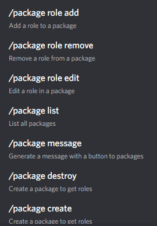
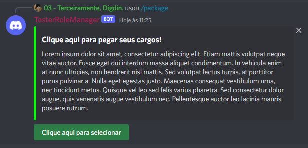
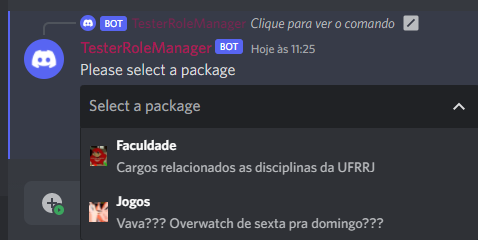
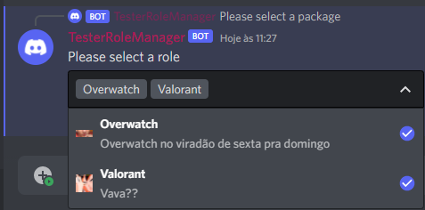

    

<h1 align="center">Capivara</h1>

Capivara é um bot para 'Discord' com o objetivo de facilitar a gerência de cargos, permissões, denúncias e muito mais.

No atual formato o bot é separado em 3 partes:

## Pacotes

### 1. PackageGroup

Pacotes são um conjunto de cargos agrupados por algum objetivo arbitrário. 
Por exemplo, um pacote pode ser um grupo de cargos que são representam os jogos que são jogados no servidor.

Neste 'Pacote' estão agrupados todos os comandos relacionados ao gerenciamento de pacotes.

    

#### Exemplos de uso

    

    

    

### 2. RoleGroup

TODO

### 3. ReportGroup

TODO

## Resumo do Fluxo

[Clique aqui para a exposição completa](./docs/fluxo.md)

