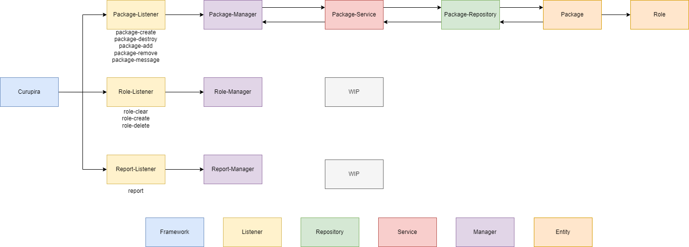

# Fluxo Simplificado

Não irei focar em explicar o fluxo em detalhes (chamadas de função e retornos) 
apenas explicar a ideia por trás de cada package do repositório e suas funções.

### Listeners / Groups

Os Listeners/Groups são responsáveis por receber o repasse de eventos do [curupira](https://github.com/Softawii/curupira)
e executar as funções associadas ao evento. No geral não é interessante manter muita lógica e 
regra de negócio dentro do Group, apenas o repasse para o Manager.

No geral as únicas regras que aplicamos são para entender para qual 
função do Manager iremos repassar as informações, mas pode ser função do Manager entender isso.

### Manager

No geral aplica as regras de negócio, consulta o banco de dados e repassa para os Listeners.

### Services

Camada auxiliar para não ocorrer a consulta direta ao banco, essa camada pode 
armazenar informações em cache, caso necessário no futuro.

### Repositories

Responsável pela comunicação com o banco de dados.

### Entities

As entidades que estão no banco em si.